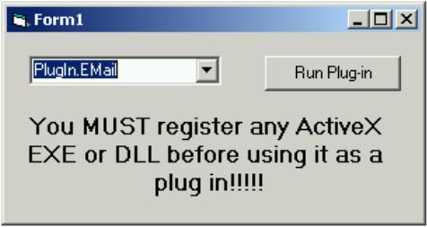



## Add Plug\-Ins to your applications\!\!\!

### Description

I know this is a zip, but if you like it, come back and VOTE! This is a simple project to show you how to add plug-ins to your apps. What do I mean by plug-ins? I mean the ability for your program to add unlimited functionality by the addition of DLLs or ActiveX exe's AFTER COMPILE. You can have a completely compiled application that simply takes a new DLL and makes it a part of itself. Why should you use it? Think of a large database application. You sell this to many users, and they all have legacy data to deal with, so you sell each of the a custom built plug-in that will convert all of thier old data. Or, if they have a custom app of thier own and they want a function that will automatically update info from thier database to yours, you could write a plugin. The possibilities are limitless, so here's the code!
 
### More Info
 
You supply the inputs, or plug-ins. One note: The plug ins must be ActiveX DLLs or ActiveX EXEs and they must be registered!

YOU MUST REGISTER YOUR PLUGINS (regsvr32.exe)

             |
---                |---
**Submitted On**   |2000-08-11 16:35:30
**By**             |[Jay Kreusch](https://github.com/Planet-Source-Code/PSCIndex/blob/master/ByAuthor/jay-kreusch.md)
**Level**          |Intermediate
**User Rating**    |4.8 (178 globes from 37 users)
**Compatibility**  |VB 4\.0 \(32\-bit\), VB 5\.0, VB 6\.0
**Category**       |[Complete Applications](https://github.com/Planet-Source-Code/PSCIndex/blob/master/ByCategory/complete-applications__1-27.md)
**World**          |[Visual Basic](https://github.com/Planet-Source-Code/PSCIndex/blob/master/ByWorld/visual-basic.md)
**Archive File**   |[CODE\_UPLOAD88758112000\.zip](https://github.com/Planet-Source-Code/jay-kreusch-add-plug-ins-to-your-applications__1-10613/archive/master.zip)

